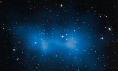

# Preview of potw1414a: "Hubble weighs “the fat one”"
[https://www.spacetelescope.org/images/potw1414a/](https://www.spacetelescope.org/images/potw1414a/)

When astronomical objects are named, astronomers like to pick out notable features for inspiration — for example, the Whirlpool Galaxy with its pinwheeling arms, or the Needle Galaxy, which appears as a long, thin streak of silver across the sky. This image shows a galaxy cluster known as El Gordo, or “the fat one”, a very distant object that lies some ten billion light-years away from us. This grouping of galaxies certainly lives up to its nickname; it is the largest known galaxy cluster in the distant Universe and contains several hundred galaxies. What’s more, new NASA/ESA Hubble Space Telescope observations show that it is actually some 43 percent heavier than previously thought, with a mass some three million billion times the mass of the Sun — which is 3000 times the mass of our own galaxy, the Milky Way. A small fraction of the cluster’s immense mass is locked up in the galaxies that inhabit it, and a larger fraction is held in hot gas that fills its entire volume, but the majority is made up of the infamous, and invisible, dark matter. The location of this dark matter is mapped out in the blue overlay. Although galaxy clusters as massive as this do exist in the nearby Universe, for example the Bullet Cluster, nothing like this has ever been seen to exist so far back in time, when the Universe was roughly half of its current age of 13.8 billion years. Astronomers previously weighed El Gordo back in January 2012, studying the unusual cluster’s appearance and dynamics in the X-ray part of the spectrum. This new Hubble study instead analysed how the huge cluster affected the space around it to get an idea of its mass. Large clumps of mass warp space and distort the view of more distant objects. This process, known as gravitational lensing, allows astronomers to estimate the mass of the clumps that are causing this distortion.