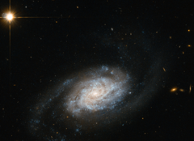

# Preview of potw1415a: "Galaxies spiralling around Leo"
[https://www.spacetelescope.org/images/potw1415a/](https://www.spacetelescope.org/images/potw1415a/)

Shown here is a spiral galaxy known as NGC 3455, which lies some 65 million light-years away from us in the constellation of Leo (The Lion). Galaxies are classified into different types according to their structure and appearance. This classification system is known as the Hubble Sequence, named after its creator Edwin Hubble. In this sequence, NGC 3455 is known as a type SB galaxy — a barred spiral. Barred spiral galaxies account for approximately two thirds of all spirals. Galaxies of this type appear to have a bar of stars slicing through the bulge of stars at their centre. The SB classification is further sub-divided by the appearance of a galaxy's pinwheeling spiral arms; SBa types have more tightly wound arms, whereas SBc types have looser ones. SBb types, such as NGC 3455, lie in between. NGC 3455 is part of a pair of galaxies — its partner, NGC 3454, lies out of frame. This cosmic duo belong to a group known as the NGC 3370 group, which is in turn one of the Leo II groups, a large collection of galaxies scattered some 30 million light-years to the right of the Virgo cluster. This new image is from Hubble's Advanced Camera for Surveys (ACS). A version of this image was entered into the Hubble's Hidden Treasures image processing competition by contestant Nick Rose.