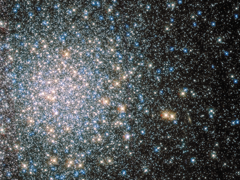

# Preview of potw1416a: "Cosmic fairy lights"
[https://www.spacetelescope.org/images/potw1416a/](https://www.spacetelescope.org/images/potw1416a/)

This sparkling jumble is Messier 5 — a globular cluster consisting of hundreds of thousands of stars bound together by their collective gravity. But Messier 5 is no normal globular cluster. At 13 billion years old it is incredibly old, dating back to close to the beginning of the Universe, which is some 13.8 billion years of age. It is also one of the biggest clusters known, and at only 24 500 light-years away, it is no wonder that Messier 5 is a popular site for astronomers to train their telescopes on. Messier 5 also presents a puzzle. Stars in globular clusters grow old and wise together. So Messier 5 should, by now, consist of old, low-mass red giants and other ancient stars. But it is actually teeming with young blue stars known as blue stragglers. These incongruous stars spring to life when stars collide, or rip material from one another.