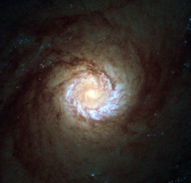

# Preview of potw1417a: "A hungry starburst galaxy"
[https://www.spacetelescope.org/images/potw1417a/](https://www.spacetelescope.org/images/potw1417a/)

This new Hubble picture is the sharpest ever image of the core of spiral galaxy Messier 61 and the central part of the galaxy is shown in striking detail. The image is comprised of 2003 and 2004 data from the now decommissioned High Resolution Channel (HRC) of Hubble's Advanced Camera for Surveys. Also known as NGC 4303, this galaxy is roughly 100 000 light-years across, comparable in size to our galaxy, the Milky Way. Both Messier 61 and our home galaxy belong to a group of galaxies known as the Virgo Supercluster in the constellation of Virgo (The Virgin) — a group of galaxy clusters containing up to 2000 spiral and elliptical galaxies in total. Messier 61 is a type of galaxy known as a starburst galaxy. Starburst galaxies experience an incredibly high rate of star formation, hungrily using up their reservoir of gas in a very short period of time (in astronomical terms). But this is not the only activity going on within the galaxy; deep at its heart there is thought to be a supermassive black hole that is violently spewing out radiation. Despite its inclusion in the Messier Catalogue, Messier 61 was actually discovered by Italian astronomer Barnabus Oriani in 1779. Charles Messier also noticed this galaxy on the very same day as Oriani, but mistook it for a passing comet — the comet of 1779. A version of this image was submitted to the Hubble’s Hidden Treasures image processing competition by Flickr user Det58.