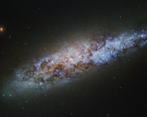

# Preview of potw1418a: "The scale of the Universe"
[https://www.spacetelescope.org/images/potw1418a/](https://www.spacetelescope.org/images/potw1418a/)

This bundle of bright stars and dark dust is a dwarf spiral galaxy known as NGC 4605, located around 16 million light-years away in the constellation of Ursa Major (The Great Bear). This galaxy’s spiral structure is not obvious from this image, but NGC 4605 is classified as an SBc type galaxy — meaning that it has sprawling, loosely wound arms and a bright bar of stars cutting through its centre. NGC 4605 is a member of the Messier 81 group of galaxies, a gathering of bright galaxies including its namesake Messier 81 (heic0710), and the well-known Messier 82 (heic0604a). Galaxy groups like this usually contain around 50 galaxies, all loosely bound together by gravity. This group is famous for its unusual members, many of which formed from  collisions between galaxies. With its somewhat unusual form, NGC 4605  fits in well with the family of perturbed galaxies in the M81  group, although the origin of its abnormal features is not yet clear. The Messier 81 group is one of the nearest groups to our own, the Local Group, which houses the Milky Way and some of its well-known neighbours, including the Andromeda Galaxy and the Magellanic Clouds. Galaxy groups provide environments where galaxies can evolve through interactions like collisions and mergers. These galaxy groups are then lumped together into even larger gatherings of galaxies known as clusters and superclusters. The Local and Messier 81 groups both belong to the Virgo Supercluster, a large and massive collection of some 100 galaxy groups and clusters. With so many galaxies swarming around, NGC 4605 may seem unremarkable. However, astronomers are using this galaxy to test our knowledge of stellar evolution. The newly-formed stars in NGC 4605 are being used to investigate how interactions between galaxies affect the formation, evolution, and behaviour of the stars within, how bright stellar nurseries come together to form stellar clusters and stellar associations, and how these stars evolve over time. And that's not all — NGC 4605 is also proving to be a good testing ground for dark matter. Our theories on this hypothetical type of matter have had good success at describing how the Universe looks and behaves on a large scale — for example at the galaxy supercluster level — but when looking at individual galaxies, they have run into problems. Observations of NGC 4605 show that the way in which dark matter is spread throughout its halo is not quite as these models predict. While intriguing, observations in this area are still inconclusive, leaving astronomers to ponder over the contents of the Universe.