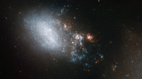

# Preview of potw1419a: "Starbursts in the wake of a fleeting romance"
[https://www.spacetelescope.org/images/potw1419a/](https://www.spacetelescope.org/images/potw1419a/)

This image shows galaxy NGC 4485 in the constellation of Canes Venatici (The Hunting Dogs). The galaxy is irregular in shape, but it hasn’t always been so. Part of NGC 4485 has been dragged towards a second galaxy, named NGC 4490 — which lies out of frame to the bottom right of this image. Between them, these two galaxies make up a galaxy pair called Arp 269. Their interactions have warped them both, turning them from spiral galaxies into irregular ones. NGC 4485 is the smaller galaxy in this pair, which provides a fantastic real-world example for astronomers to compare to their computer models of galactic collisions. The most intense interaction between these two galaxies is all but over; they have made their closest approach and are now separating. The trail of bright stars and knotty orange clumps that we see here extending out from NGC 4485 is all that connects them — a trail that spans some 24 000 light-years. Many of the stars in this connecting trail could never have existed without the galaxies’ fleeting romance. When galaxies interact hydrogen gas is shared between them, triggering intense bursts of star formation. The orange knots of light in this image are examples of such regions, clouded with gas and dust. A version of this image was entered into the Hubble’s Hidden Treasures image processing competition by contestant Kathy van Pelt, and won sixth prize in the “basic image searching” category.