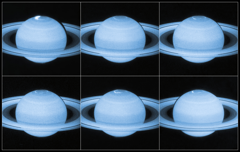

# Preview of potw1420a: "Hubble sees a flickering light display on Saturn"
[https://www.spacetelescope.org/images/potw1420a/](https://www.spacetelescope.org/images/potw1420a/)

Astronomers using the NASA/ESA Hubble Space Telescope have captured new images of the dancing auroral lights at Saturn’s north pole. Taken from Hubble’s perspective in orbit around the Earth, these images provide a detailed look at Saturn’s stormy aurorae — revealing previously unseen dynamics in the choreography of the auroral glow. The cause of the changing patterns in Saturn's aurorae is an ongoing mystery in planetary science. These ultraviolet images, taken by Hubble’s super-sensitive Advanced Camera for Surveys, add new insight by capturing moments when Saturn’s magnetic field is affected by bursts of particles streaming out from the Sun. Saturn has a long, comet-like magnetic tail known as a magnetotail — as do Mercury, Jupiter, Uranus, Neptune and Earth [1]. This magnetotail is present around planets that have a magnetic field, caused by a rotating core of magnetic elements. It appears that when bursts of particles from the Sun hit Saturn, the planet’s magnetotail collapses and later reconfigures itself, an event that is reflected in the dynamics of its aurorae. Some of the bursts of light seen shooting around Saturn’s polar regions travelled at over three times faster than the speed of the gas giant’s rotation! The new images also formed part of a joint observing campaign between Hubble and NASA's Cassini spacecraft, which is currently in orbit around Saturn itself. Between them, the two spacecraft managed to capture a 360-degree view of the planet’s aurorae at both the north and south poles. Cassini also used optical imaging to delve into the rainbow of colours seen in Saturn’s light shows. On Earth, we see green curtains of light with flaming scarlet tops. Cassini’s imaging cameras reveal similar auroral veils on Saturn, that are red at the bottom and violet at the top. Notes [1] A magnetosphere is the area of space around an astronomical object in which charged particles are controlled by that object’s magnetic field. The magnetosphere is compressed on the side of the sun, and on the other side it extends far beyond the object. It is this extended region of the magnetosphere that is known as the magnetotail.