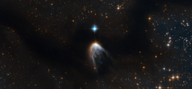

# Preview of potw1421a: "Violent birth announcement from an infant star"
[https://www.spacetelescope.org/images/potw1421a/](https://www.spacetelescope.org/images/potw1421a/)

This new Hubble image shows IRAS 14568-6304, a young star that is cloaked in a haze of golden gas and dust. It appears to be embedded within an intriguing swoosh of dark sky, which curves through the image and obscures the sky behind. This dark region is known as the Circinus molecular cloud. This cloud has a mass around 250 000 times that of the Sun, and it is filled with gas, dust and young stars. Within this cloud lie two prominent and enormous regions known colloquially to astronomers as Circinus-West and Circinus-East. Each of these clumps has a mass of around 5000 times that of the Sun, making them the most prominent star-forming sites in the Circinus cloud. The clumps are associated with a number of young stellar objects, and IRAS 14568-6304, featured here under a blurry fog of gas within Circinus-West, is one of them. IRAS 14568-6304 is special because it is driving a protostellar jet, which appears here as the "tail" below the star. This jet is the leftover gas and dust that the star took from its parent cloud in order to form. While most of this material forms the star and its accretion disc — the disc of material surrounding the star, which may one day form planets — at some point in the formation process the star began to eject some of the material at supersonic speeds through space. This phenomenon is not only beautiful, but can also provide us with valuable clues about the process of star formation. IRAS 14568-6304 is one of several outflow sources in the Circinus-West clump. Together, these sources make up one of the brightest, most massive, and most energetic outflows ever reported. Scientists have even suggested calling Circinus-West the "nest of molecular outflows" in tribute to this activity. A version of this image was entered into the Hubble's Hidden Treasures image processing competition by contestant Serge Meunier.