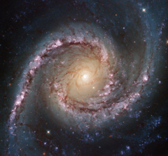

# Preview of potw1422a: "Grand swirls"
[https://esahubble.org/images/potw1422a/](https://esahubble.org/images/potw1422a/)

This new Hubble image shows NGC 1566, a beautiful galaxy located approximately 40 million light-years away in the constellation of Dorado (The Dolphinfish). NGC 1566 is an intermediate spiral galaxy, meaning that while it does not have a well defined bar-shaped region of stars at its centre — like barred spirals — it is not quite an unbarred spiral either (heic9902o). The small but extremely bright nucleus of NGC 1566 is clearly visible in this image, a telltale sign of its membership of the Seyfert class of galaxies. The centres of such galaxies are very active and luminous, emitting strong bursts of radiation and potentially harbouring supermassive black holes that are many millions of times the mass of the Sun. NGC 1566 is not just any Seyfert galaxy; it is the second brightest Seyfert galaxy known. It is also the brightest and most dominant member of the Dorado Group, a loose concentration of galaxies that together comprise one of the richest galaxy groups of the southern hemisphere. This image highlights the beauty and awe-inspiring nature of this unique galaxy group, with NGC 1566 glittering and glowing, its bright nucleus framed by swirling and symmetrical lavender arms. This image was taken by Hubble’s Wide Field Camera 3 (WFC3) in the near-infrared part of the spectrum. A version of the image was entered into the Hubble’s Hidden Treasures image processing competition by Flickr user Det58.