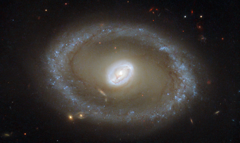

# Preview of potw1423a: "Golden rings of star formation"
[https://www.spacetelescope.org/images/potw1423a/](https://www.spacetelescope.org/images/potw1423a/)

Taking centre stage in this new NASA/ESA Hubble Space Telescope image is a galaxy known as NGC 3081, set against an assortment of glittering galaxies in the distance. Located in the constellation of Hydra (The Sea Serpent), NGC 3081 is located over 86 million light-years from us. It is known as a type II Seyfert galaxy, characterised by its dazzling nucleus. NGC 3081 is seen here nearly face-on. Compared to other spiral galaxies, it looks a little different. The galaxy's barred spiral centre is surrounded by a bright loop known as a resonance ring. This ring is full of bright clusters and bursts of new star formation, and frames the supermassive black hole thought to be lurking within NGC 3081 — which glows brightly as it hungrily gobbles up infalling material. These rings form in particular locations known as resonances, where gravitational effects throughout a galaxy cause gas to pile up and accumulate in certain positions. These can be caused by the presence of a "bar" within the galaxy, as with NGC 3081, or by interactions with other nearby objects. It is not unusual for rings like this to be seen in barred galaxies, as the bars are very effective at gathering gas into these resonance regions, causing pile-ups which lead to active and very well-organised star formation. Hubble snapped this magnificent face-on image of the galaxy using the Wide Field Planetary Camera 2. This image is made up of a combination of ultraviolet, optical, and infrared observations, allowing distinctive features of the galaxy to be observed across a wide range of wavelengths. Notes A paper based on these observations was published in The Astronomical Journal in 2004, entitled "A Hubble Space Telescope Study of Star Formation in the Inner Resonance Ring of NGC 3081" by Ronald J. Buta, Gene G. Byrd, and Tarsh Freeman.