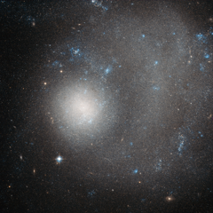

# Preview of potw1424a: "A dwarf galaxy ravaged by grand design"
[https://www.spacetelescope.org/images/potw1424a/](https://www.spacetelescope.org/images/potw1424a/)

The subject of this new Hubble image is NGC 5474, a dwarf galaxy located 21 million light-years away in the constellation of Ursa Major (The Great Bear). This beautiful image was taken with Hubble's Advanced Camera for Surveys (ACS). The term "dwarf galaxy" may sound diminutive, but don't let that fool you — NGC 5474 contains several billion stars! However, when compared to the Milky Way with its hundreds of billions of stars, NGC 5474 does indeed seem relatively small. NGC 5474 itself is part of the Messier 101 Group. The brightest galaxy within this group is the well-known spiral Pinwheel Galaxy (also known as Messier 101, heic0602). This galaxy's prominent, well-defined arms classify it as a "grand design galaxy", along with other spirals Messier 81 (heic0710) and Messier 74 (heic0719). Also within this group are Messier 101's galactic neighbours. It is possible that gravitational interactions with these companion galaxies have had some influence on providing Messier 101 with its striking shape. Similar interactions with Messier 101 may have caused the distortions visible in NGC 5474. Both the Messier 101 Group and our own Local Group reside within the Virgo Supercluster, making NGC 5474 something of a neighbour in galactic terms.