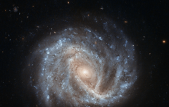

# Preview of potw1425a: "A curious supernova in NGC 2441"
[https://www.spacetelescope.org/images/potw1425a/](https://www.spacetelescope.org/images/potw1425a/)

This bright spiral galaxy is known as NGC 2441, located in the northern constellation of Camelopardalis (The Giraffe). However, NGC 2441 is not the only subject of this new Hubble image; the galaxy contains an intriguing supernova named SN1995E, visible as a small dot at the approximate centre of this image. For a labelled view, see potw1425b. Supernova SN1995E, discovered in 1995 as its name suggests is a type Ia supernova. This kind of supernova is found in binary systems, where one star — a white dwarf — drags matter from its orbiting companion until it becomes unstable and explodes violently. White dwarf stars all become unbalanced once they reach the same mass, meaning that they all form supernovae with the same intrinsic brightness. Because of this, they are used as standard candles to measure distances in the Universe. But SN1995E may be useful in another way. More recent observations of this supernova have suggested that it may display a phenomenon known as a light echo, where light is scattered and deflected by dust along our line of sight, making it appear to “echo” outwards from the source. In 2006, Hubble observed SN1995E to be fading in a way that suggested its light was being scattered by a surrounding spherical shell of dust. These echoes can be used to probe both the environments around cosmic objects like supernovae, and the characteristics of their progenitor stars. If SN1995E does indeed have a light echo, it would belong to a very elite club; only two other type Ia supernovae have been found to display light echoes (SN1991T and SN1998bu). NGC 2441 was first seen by Wilhelm Tempel in 1882, a German astronomer with a keen eye for comets. In total, Tempel observed and documented some 21 comets, several of which were named after him. A version of this image was entered into the Hubble’s Hidden Treasures image processing competition by contestant Nick Rose. Link:  A curious supernova in NGC 2441 (annotated) 