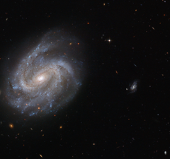

# Preview of potw1426a: "A fossil in the making"
[https://www.spacetelescope.org/images/potw1426a/](https://www.spacetelescope.org/images/potw1426a/)

Discovered by astronomer William Herschel in the late 1700s, NGC 201 is a barred spiral galaxy similar to our own galaxy, the Milky Way. It lies 200 million light-years from Earth in the constellation of Cetus (The Sea Monster), and is invisible to the naked eye. This new NASA/ESA Hubble Space Telescope image of NGC 201 shows the galaxy in striking detail, capturing the bright centre and the barred spiral arms — arms that do not start directly from the galactic centre, but instead seem to be offset and stem from a "bar" of stars cutting through the middle of the galaxy. Along with three of its closest galactic neighbours (outside the frame), NGC 201 belongs to a group known as the HCG 7 compact galactic group. Hickson Compact Groups (HCG) are relatively small and isolated systems containing a handful of bright, compact galaxies that lie close to one another. As the galaxies within these groups move closer together they interact strongly, dragging galactic material out into space and distorting the structure of the other group members. Eventually, all the galaxies within one HCG will merge together. Simulations have shown that within a billion years, the galaxies within one HCG have merged to form a giant fossil galaxy. It is possible that this is the final fate of all galactic groups. A version of this image was submitted to the Hubble's Hidden Treasures image processing competition by contestant Luca Limatola.