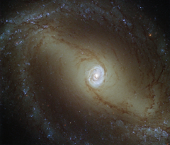

# Preview of potw1427a: "A galaxy with a glowing heart"
[https://www.spacetelescope.org/images/potw1427a/](https://www.spacetelescope.org/images/potw1427a/)

This view, captured by the NASA/ESA Hubble Space Telescope, shows a nearby spiral galaxy known as NGC 1433. At about 32 million light-years from Earth, it is a type of very active galaxy known as a Seyfert galaxy — a classification that accounts for 10% of all galaxies. They have very bright, luminous centres comparable to that of our galaxy, the Milky Way. Galaxy cores are of great interest to astronomers. The centres of most, if not all, galaxies are thought to contain a supermassive black hole, surrounded by a disc of infalling material. NGC 1433 is being studied as part of a survey of 50 nearby galaxies known as the Legacy ExtraGalactic UV Survey (LEGUS). Ultraviolet radiation is observed from galaxies, mainly tracing the most recently formed stars. In Seyfert galaxies, ultraviolet light is also thought to emanate from the accretion discs around their central black holes. Studying these galaxies in the ultraviolet part of the spectrum is incredibly useful to study how the gas is behaving near the black hole. This image was obtained using a mix of ultraviolet, visible, and infrared light. LEGUS will study a full range of properties from a sample of galaxies, including their internal structure. This Hubble survey will provide a unique foundation for future observations with the James Webb Space Telescope (JWST) and the Atacama Large Millimeter/submillimeter Array (ALMA). ALMA has already caught unexpected results relating to the centre of NGC 1433, finding a surprising spiral structure in the molecular gas close to the centre of NGC 1433. The astronomers also found a jet of material flowing away from the black hole, extending for only 150 light-years — the smallest such molecular outflow ever observed in a galaxy beyond our own. Links   Black Holes and Revelations (Space Scoop) 