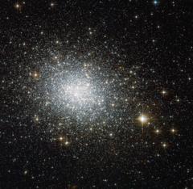

# Preview of potw1428a: "The oldest cluster in its cloud"
[https://www.spacetelescope.org/images/potw1428a/](https://www.spacetelescope.org/images/potw1428a/)

This image shows NGC 121, a globular cluster in the constellation of Tucana (The Toucan). Globular clusters are big balls of old stars that orbit the centres of their galaxies like satellites — the Milky Way, for example, has around 150. NGC 121 belongs to one of our neighbouring galaxies, the Small Magellanic Cloud (SMC). It was discovered in 1835 by English astronomer John Herschel, and in recent years it has been studied in detail by astronomers wishing to learn more about how stars form and evolve. Stars do not live forever — they develop differently depending on their original mass. In many clusters, all the stars seem to have formed at the same time, although in others we see distinct populations of stars that are different ages. By studying old stellar populations in globular clusters, astronomers can effectively use them as tracers for the stellar population of their host galaxies. With an object like NGC 121, which lies close to the Milky Way, Hubble is able to resolve individual stars and get a very detailed insight. NGC 121 is around 10 billion years old, making it the oldest cluster in its galaxy; all of the SMC's other globular clusters are 8 billion years old or younger. However, NGC 121 is still several billions of years younger than its counterparts in the Milky Way and in other nearby galaxies like the Large Magellanic Cloud. The reason for this age gap is not completely clear, but it could indicate that cluster formation was initially delayed for some reason in the SMC, or that NGC 121 is the sole survivor of an older group of star clusters. This image was taken using Hubble’s Advanced Camera for Surveys (ACS). A version of this image was submitted to the Hubble’s Hidden Treasures image processing competition by contestant Stefano Campani.