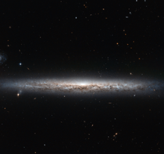

# Preview of potw1429a: "A slice of stars"
[https://www.spacetelescope.org/images/potw1429a/](https://www.spacetelescope.org/images/potw1429a/)

The thin, glowing streak slicing across this image cuts a lonely figure, with only a few foreground stars and galaxies in the distant background for company. However, this is all a case of perspective; lying out of frame is another nearby spiral. Together, these two galaxies make up a pair, moving through space together and keeping one another company. The subject of this Hubble image is called NGC 3501, with NGC 3507 as its out-of-frame companion. The two galaxies look very different — another example of the importance of perspective. NGC 3501 appears edge-on, giving it an elongated and very narrow appearance. Its partner, however, looks very different indeed, appearing face-on and giving us a fantastic view of its barred swirling arms. While similar arms may not be visible in this image of NGC 3501, this galaxy is also a spiral — although it is somewhat different from its companion. While NGC 3507 has bars cutting through its centre, NGC 3501 does not. Instead, its loosely wound spiral arms all originate from its centre. The bright gas and stars that make up these arms can be seen here glowing brightly, mottled by the dark dust lanes that trace across the galaxy. A version of this image was entered into the Hubble's Hidden Treasures image processing competition by contestant Nick Rose.