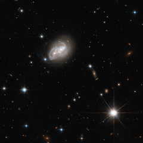

# Preview of potw1430a: "Galaxy gets a cosmic hair ruffling"
[https://www.spacetelescope.org/images/potw1430a/](https://www.spacetelescope.org/images/potw1430a/)

From objects as small as Newton's apple to those as large as a galaxy, no physical body is free from the stern bonds of gravity, as evidenced in this stunning picture captured by the Wide Field Camera 3 and Advanced Camera for Surveys onboard the NASA/ESA Hubble Space Telescope. Here we see two spiral galaxies engaged in a cosmic tug-of-war — but in this contest, there will be no winner. The structures of both objects are slowly distorted to resemble new forms, and in some cases, merge together to form new, super galaxies. This particular fate is similar to that of the Milky Way Galaxy, when it will ultimately merge with our closest galactic partner, the Andromeda Galaxy. There is no need to panic however, as this process takes several hundreds of millions of years. Not all interacting galaxies result in mergers though. The merger is dependent on the mass of each galaxy, as well as the relative velocities of each body. It is quite possible that the event pictured here, romantically named 2MASX J06094582-2140234, will avoid a merger event altogether, and will merely distort the arms of each spiral without colliding — the cosmic equivalent of a hair ruffling! These galactic interactions also trigger new regions of star formation in the galaxies involved, causing them to be extremely luminous in the infrared part of the spectrum. For this reason, these types of galaxies are referred to as LIRGs, or Luminous Infrared Galaxies. This image was taken as part of as part of a Hubble survey of the central regions of LIRGs in the local Universe, which also used the NICMOS instrument. A version of this image was entered into the Hubble's Hidden Treasures image processing competition by contestant Luca Limatola.