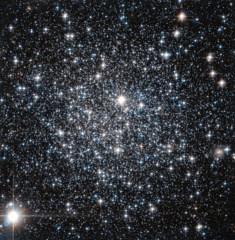

# Preview of potw1431a: "IC 4499: A globular cluster’s age revisited"
[https://www.spacetelescope.org/images/potw1431a/](https://www.spacetelescope.org/images/potw1431a/)

This new NASA/ESA Hubble Space Telescope image shows the globular cluster IC 4499. Globular clusters are big balls of old stars that orbit around their host galaxy.  It has long been believed that all the stars within a globular cluster form at the about same time, a property which can be used to determine the cluster's age. For more massive globulars however, detailed observations have shown that this is not entirely true — there is evidence that they instead consist of multiple populations of stars born at different times. One of the driving forces behind this behaviour is thought to be gravity: more massive globulars manage to grab more gas and dust, which can then be transformed into new stars. IC 4499 is a somewhat special case. Its mass lies somewhere between low-mass globulars, which show a single generation build-up, and the more complex and massive globulars which can contain more than one generation of stars. By studying objects like IC 4499 astronomers can therefore explore how mass affects a cluster's contents. Astronomers found no sign of multiple generations of stars in IC 4499 — supporting the idea that less massive clusters in general only consist of a single stellar generation. Hubble observations of IC 4499 have also helped to pinpoint the cluster's age: observations of this cluster from the 1990s suggested a puzzlingly young age when compared to other globular clusters within the Milky Way. However, since those first estimates new Hubble data been obtained, and it has been found to be much more likely that IC 4499 is actually roughly the same age as other Milky Way clusters at approximately 12 billion years old.