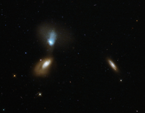

# Preview of potw1432a: "Galactic soup"
[https://www.spacetelescope.org/images/potw1432a/](https://www.spacetelescope.org/images/potw1432a/)

This new NASA/ESA Hubble Space Telescope image shows a whole host of colourful and differently shaped galaxies; some bright and nearby, some fuzzy, and some so far from us they appear as small specks in the background sky. The most prominent characters are the two galaxies on the left — 2MASX J16133219+5103436 at the bottom, and its blue-tinted companion SDSS J161330.18+510335 at the top. The latter is slightly closer to us than its partner, but the two are still near enough to one another to interact. Together, the two make up a galactic pair named Zw I 136. Both galaxies in this pair have disturbed shapes and extended soft halos. They don’t seem to conform to our view of a “typical” galaxy — unlike the third bright object in this frame, a side-on spiral seen towards the right of the image. Astronomers classify galaxies according to their appearance and their shape. The most famous classification scheme is known as the Hubble sequence, devised by its namesake Edwin Hubble. One of the great questions in galaxy evolution is how interactions between galaxies trigger waves of star formation, and why these stars then abruptly stop forming. Interacting pairs like this one present astronomers with perfect opportunities to investigate this. A version of this image was entered into the Hubble's Hidden Treasures image processing competition by contestant Judy Schmidt.