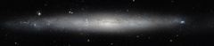

# Preview of potw1433a: "A silver needle in the sky"
[https://www.spacetelescope.org/images/potw1433a/](https://www.spacetelescope.org/images/potw1433a/)

This stunning new image from the NASA/ESA Hubble Space Telescope shows part of the sky in the constellation of Canes Venatici (The Hunting Dogs). Although this region of the sky is not home to any stellar heavyweights, being mostly filled with stars of average brightness, it does contain five Messier objects and numerous intriguing galaxies — including NGC 5195, a small barred spiral galaxy considered to be one of the most beautiful galaxies visible, and its nearby interacting partner the Whirlpool Galaxy (heic0506a). The quirky Sunflower Galaxy is another notable galaxy in this constellation, and is one of the largest and brightest edge-on galaxies in our skies. Joining this host of characters is spiral galaxy NGC 4244, nicknamed the Silver Needle Galaxy, shown here in a new image from Hubble. This galaxy spans some 65 000 light-years and lies around 13.5 million light-years away. It appears as a wafer-thin streak across the sky, with its loosely wound spiral arms hidden from view as we observe the galaxy side on. It is part of a group of galaxies known as the M94 Group [1]. Numerous bright clumps of gas can be seen scattered across its length, along with dark dust lanes surrounding the galaxy’s core. NGC 4244 also has a bright star cluster at its centre. Although we can make out the galaxy’s bright central region and star-spattered arms, we cannot see any more intricate structure due to the galaxy’s position; from Earth, we see it stretched out as a flattened streak across the sky. A number of different observations were pieced together to form this mosaic, and gaps in Hubble’s coverage have been filled in using ground-based data. The Hubble observations were taken as part of the GHOSTS survey, which is scanning nearby galaxies to explore how they and their stars formed to get a more complete view of the history of the Universe. Notes [1]  Our home group, containing the Milky Way and many others, is known as the Local Group. M94 is relatively close to the Local Group.