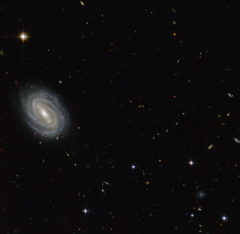

# Preview of potw1435a: "Spiral in Serpens"
[https://www.spacetelescope.org/images/potw1435a/](https://www.spacetelescope.org/images/potw1435a/)

This new NASA/ESA Hubble Space Telescope image shows a beautiful spiral galaxy known as PGC 54493, located in the constellation of Serpens (The Serpent). This galaxy is part of a galaxy cluster that has been studied by astronomers exploring an intriguing phenomenon known as weak gravitational lensing. This effect, caused by the uneven distribution of matter (including dark matter) throughout the Universe, has been explored via surveys such as the Hubble Medium Deep Survey. Dark matter is one of the great mysteries in cosmology. It behaves very differently from ordinary matter as it does not emit or absorb light or other forms of electromagnetic energy — hence the term "dark". Even though we cannot observe dark matter directly, we know it exists. One prominent piece of evidence for the existence of this mysterious matter is known as the "galaxy rotation problem". Galaxies rotate at such speeds and in such a way that ordinary matter alone — the stuff we see — would not be able to hold them together. The amount of mass that is "missing" visibly is dark matter, which is thought to make up some 27% of the total contents of the Universe, with dark energy and normal matter making up the rest. PGC 55493 has been studied in connection with an effect known as cosmic shearing. This is a weak gravitational lensing effect that creates tiny distortions in images of distant galaxies. A version of this image was entered into the Hubble's Hidden Treasures image processing competition by contestant Judy Schmidt. Links  Hubble Advanced Camera for Surveys (ACS) 