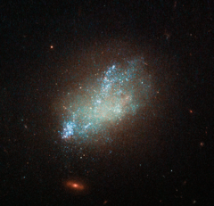

# Preview of potw1436a: "A spattering of blue"
[https://www.spacetelescope.org/images/potw1436a/](https://www.spacetelescope.org/images/potw1436a/)

Far beyond the stars in the constellation of Leo (The Lion) is irregular galaxy IC 559. IC 559 is not your everyday galaxy. With its irregular shape and bright blue spattering of stars, it is a fascinating galactic anomaly. It may look like sparse cloud, but it is in fact full of gas and dust which is spawning new stars. Discovered in 1893, IC 559 lacks the symmetrical spiral appearance of some of its galactic peers and not does not conform to a  regular shape. It is actually classified as a “type Sm” galaxy — an irregular galaxy with some evidence for a spiral structure. Irregular galaxies make up about a quarter of all known galaxies and do not fall into any of the regular classes of the Hubble sequence. Most of these uniquely shaped galaxies were not always so — IC 559 may have once been a conventional spiral galaxy that was then distorted and twisted by the gravity of a nearby cosmic companion. This image, captured by the NASA/ESA Hubble Space Telescope’s Wide Field Camera 3, combines a wide range of wavelengths spanning the ultraviolet, optical, and infrared parts of the spectrum.