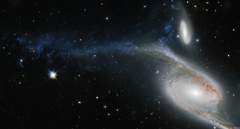

# Preview of potw1437a: "An interacting colossus"
[https://www.spacetelescope.org/images/potw1437a/](https://www.spacetelescope.org/images/potw1437a/)

This picture, taken by the NASA/ESA Hubble Space Telescope’s Wide Field Planetary Camera 2 (WFPC2), shows a galaxy known as NGC 6872 in the constellation of Pavo (The Peacock). Its unusual shape is caused by its interactions with the smaller galaxy that can be seen just above NGC 6872, called IC 4970. They both lie roughly 300 million light-years away from Earth. From tip to tip, NGC 6872 measures over 500 000 light-years across, making it the second largest spiral galaxy discovered to date. In terms of size it is beaten only by NGC 262, a galaxy that measures a mind-boggling 1.3 million light-years in diameter! To put that into perspective, our own galaxy, the Milky Way, measures between 100 000 and 120 000 light-years across, making NGC 6872 about five times its size. The upper left spiral arm of NGC 6872 is visibly distorted and is populated by star-forming regions, which appear blue on this image. This may have been be caused by IC 4970 recently passing through this arm — although here, recent means 130 million years ago! Astronomers have noted that NGC 6872 seems to be relatively sparse in terms of free hydrogen, which is the basis material for new stars, meaning that if it weren’t for its interactions with IC 4970, NGC 6872 might not have been able to produce new bursts of star formation. A version of this image was entered into the Hubble’s Hidden Treasures image processing competition by contestant Judy Schmidt.