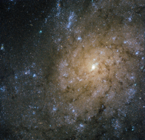

# Preview of potw1438a: "Jets and explosions in NGC 7793"
[https://www.spacetelescope.org/images/potw1438a/](https://www.spacetelescope.org/images/potw1438a/)

This new image from the NASA/ESA Hubble Space Telescope shows NGC 7793, a spiral galaxy in the constellation of Sculptor some 13 million light-years away from Earth. NGC 7793 is one of the brightest galaxies in the Sculptor Group, and one of the closest groups of galaxies to the Local Group — the group of galaxies containing our galaxy, the Milky Way and the Magellanic Clouds. The image shows NGC 7793’s spiral arms and small central bulge. Unlike some other spirals, NGC 7793 doesn’t have a very pronounced spiral structure, and its shape is further muddled by the mottled pattern of dark dust that stretches across the frame. The occasional burst of bright pink can be seen in the galaxy, highlighting stellar nurseries containing newly-forming baby stars. Although it may look serene and beautiful from our perspective, this galaxy is actually a very dramatic and violent place. Astronomers have discovered a powerful microquasar within NGC 7793 — a system containing a black hole actively feeding on material from a companion star. While many full-sized quasars are known at the cores of other galaxies, it is unusual to find a quasar in a galaxy’s disc rather than at its centre. Micro-quasars are almost like scale models — they allow astronomers to study quasars in detail. As material falls inwards towards this black hole, it creates a swirling disc around it. Some of the infalling gas is propelled violently outwards at extremely high speeds, creating jets streaking out into space in opposite directions. In the case of NGC 7793, these jets are incredibly powerful, and are in the process of creating an expanding bubble of hot gas some 1000 light-years across.