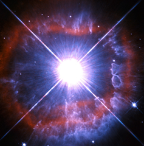

# Preview of potw1439a: "Snapshot of a shedding star"
[https://www.spacetelescope.org/images/potw1439a/](https://www.spacetelescope.org/images/potw1439a/)

In this new Hubble image, the strikingly luminous star AG Carinae — otherwise known as HD 94910 — takes centre stage. Found within the constellation of Carina in the southern sky, AG Carinae lies 20 000 light-years away, nestled in the Milky Way. AG Carinae is classified as a Luminous Blue Variable. These rare objects are massive evolved stars that will one day become Wolf-Rayet Stars — a class of stars that are tens of thousands to several million times as luminous as the Sun. They have evolved from main sequence stars that were twenty times the mass of the Sun. Stars like AG Carinae lose their mass at a phenomenal rate. This loss of mass is due to powerful stellar winds with speeds of up to 7 million km/hour. These powerful winds are also responsible for the shroud of material visible in this image. The winds exert enormous pressure on the clouds of interstellar material expelled by the star and force them into this shape. Despite HD 94910’s intense luminosity, it is not visible with the naked eye as much of its output is in the ultraviolet. This image was taken with the Wide Field and Planetary Camera 2 (WFPC2), that was installed on Hubble during the Shuttle mission STS-61 and was Hubble’s workhorse for many years. It is worth noting that the bright glare at the centre of the image is not the star itself. The star is tiny at this scale and hidden within the saturated region. The white cross is also not an astronomical phenomenon but rather an effect of the telescope.