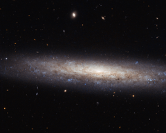

# Preview of potw1440a: "A dusty spiral in Virgo"
[https://www.spacetelescope.org/images/potw1440a/](https://www.spacetelescope.org/images/potw1440a/)

This magnificent new image taken with the NASA/ESA Hubble Space Telescope shows the edge-on spiral galaxy NGC 4206, located about 70 million light-years away from Earth in the constellation of Virgo. Captured here are vast streaks of dust, some of which are obscuring the central bulge, which can just be made out in the centre of the galaxy. Towards the edges of the galaxy, the scattered clumps, which appear blue in this image, mark areas where stars are being born. The bulge, on the other hand, is composed mostly of much older, redder stars, and very little star formation takes place. NGC 4206 was imaged as part of a Hubble snapshot survey of nearby edge-on spiral galaxies to measure the effect that the material between the stars — known as the interstellar medium — has on light as it travels through it. Using its Advanced Camera for Surveys, Hubble can reveal information about the dusty material and hydrogen gas in the cold parts of the interstellar medium. Astronomers are then able to map the absorption and scattering of light by the material — an effect known as extinction — which causes objects to appear redder to us, the observers. NGC 4206 is visible with most moderate amateur telescopes at 13th magnitude. It was discovered by Hanoverian-born British astronomer, William Herschel on 17 April 1784. A version of this image was entered into the Hubble's Hidden Treasures image processing competition by contestant Nick Rose.