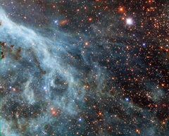

# Preview of potw1441a: "Turquoise-tinted plumes in the Large Magellanic Cloud"
[https://www.spacetelescope.org/images/potw1441a/](https://www.spacetelescope.org/images/potw1441a/)

The brightly glowing plumes seen in this image are reminiscent of an underwater scene, with turquoise-tinted currents and nebulous strands reaching out into the surroundings. However, this is no ocean. This image actually shows part of the Large Magellanic Cloud (LMC), a small nearby galaxy that orbits our galaxy, the Milky Way, and appears as a blurred blob in our skies. The NASA/ESA Hubble Space Telescope has peeked many times into this galaxy, releasing stunning images of the whirling clouds of gas and sparkling stars (opo9944a, heic1301, potw1408a). This image shows part of the Tarantula Nebula's outskirts. This famously beautiful nebula, located within the LMC, is a frequent target for Hubble (heic1206, heic1402). In most images of the LMC the colour is completely different to that seen here. This is because, in this new image, a different set of filters was used. The customary R filter, which selects the red light, was replaced by a filter letting through the near-infrared light. In traditional images, the hydrogen gas appears pink because it shines most brightly in the red. Here however, other less prominent emission lines dominate in the blue and green filters. This data is part of the Archival Pure Parallel Project (APPP), a project that gathered together and processed over 1000 images taken using Hubble’s Wide Field Planetary Camera 2, obtained in parallel with other Hubble instruments. Much of the data in the project could be used to study a wide range of astronomical topics, including gravitational lensing and cosmic shear, exploring distant star-forming galaxies, supplementing observations in other wavelength ranges with optical data, and examining star populations from stellar heavyweights all the way down to solar-mass stars. A version of this image was entered into the Hubble’s Hidden Treasures image processing competition by contestant Josh Barrington.