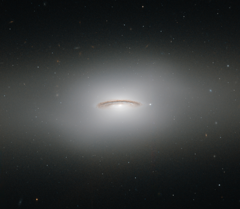

# Preview of potw1442a: "The whirling disc of NGC 4526"
[https://www.spacetelescope.org/images/potw1442a/](https://www.spacetelescope.org/images/potw1442a/)

This neat little galaxy is known as NGC 4526. Its dark lanes of dust and bright diffuse glow make the galaxy appear to hang like a halo in the emptiness of space in this new image from the NASA/ESA Hubble Space Telescope. Although this image paints a picture of serenity, the galaxy is anything but. It is one of the brightest lenticular galaxies known, a category that lies somewhere between spirals and ellipticals. It has hosted two known supernova explosions, one in 1969 and another in 1994, and is known to have a colossal supermassive black hole at its centre that has the mass of 450 million Suns. NGC 4526 is part of the Virgo cluster of galaxies. Ground-based observations of galaxies in this cluster have revealed that a quarter of these galaxies seem to have rapidly rotating discs of gas at their centres. The most spectacular of these is this galaxy, NGC 4526, whose spinning disc of gas, dust, and stars reaches out uniquely far from its heart, spanning some 7% of the galaxy's entire radius. This disc is moving incredibly fast, spinning at more than 250 kilometres per second. The dynamics of this quickly whirling region were actually used to infer the mass of NGC 4526’s central black hole — a technique that had not been used before to constrain a galaxy’s central black hole. This image was taken using Hubble’s Wide Field Planetary Camera 2.  A version of this image was entered into the Hubble’s Hidden Treasures image processing competition by contestant Judy Schmidt. Hidden Treasures was an initiative to invite astronomy enthusiasts to search the Hubble archive for stunning images that have never been seen by the general public.