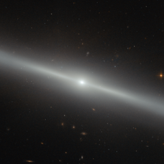

# Preview of potw1443a: "A galaxy on the edge"
[https://www.spacetelescope.org/images/potw1443a/](https://www.spacetelescope.org/images/potw1443a/)

This spectacular image was captured by the NASA/ESA Hubble Space Telescope's Advanced Camera for Surveys (ACS). The bright streak slicing across the frame is an edge-on view of galaxy NGC 4762, and a number of other distant galaxies can be seen scattered in the background. NGC 4762 lies about 58 million light-years away in the constellation of Virgo (The Virgin). It is part of the Virgo Cluster, hence its alternative designation of  VCC 2095 for Virgo Cluster Catalogue entry. This catalogue is a listing of just over 2000 galaxies in the area of the Virgo Cluster. The Virgo Cluster is actually prominently situated, and lies at the centre of the larger Virgo supercluster, of which our galaxy group, the Local Group, is a member. Previously thought to be a barred spiral galaxy, NGC 4762 has since been found to be a lenticular galaxy, a kind of intermediate step between an elliptical and a spiral. The edge-on view that we have of this particular galaxy makes it difficult to determine its true shape, but astronomers have found the galaxy to consist of four main components — a central bulge, a bar, a thick disc and an outer ring. The galaxy's disc is asymmetric and warped, which could potentially be explained by NGC 4762 violently cannibalising a smaller galaxy in the past. The remains of this former companion may then have settled within NGC 4762's disc, redistributing the gas and stars and so changing the disc's morphology. NGC 4762 also contains a Liner-type Active Galactic Nucleus, a highly energetic central region. This nucleus is detectable due to its particular spectral line emission, which acts as a type of "atomic fingerprint", allowing astronomers to measure the composition of the region.