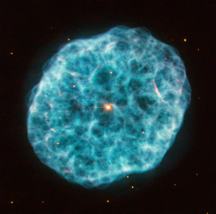

# Preview of potw1444a: "A hazy nebula"
[https://www.spacetelescope.org/images/potw1444a/](https://www.spacetelescope.org/images/potw1444a/)

This new image from Hubble’s Wide Field Planetary Camera 2 showcases NGC 1501, a complex planetary nebula located in the large but faint constellation of Camelopardalis (The Giraffe). Discovered by William Herschel in 1787, NGC 1501 is a planetary nebula that is just under 5000 light-years away from us. Astronomers have modelled the three-dimensional structure of the nebula, finding it to be a cloud shaped as an irregular ellipsoid filled with bumpy and bubbly regions. It has a bright central star that can be seen easily in this image, shining brightly from within the nebula’s cloud. This bright pearl embedded within its glowing shell inspired the nebula’s popular nickname: the Oyster Nebula. While NGC 1501's central star blasted off its outer shell long ago, it still remains very hot and luminous, although it is quite tricky for observers to spot through modest telescopes. This star has actually been the subject of many studies by astronomers due to one very unusual feature: it seems to be pulsating, varying quite significantly in brightness over a typical timescale of just half an hour. While variable stars are not unusual, it is uncommon to find one at the heart of a planetary nebula. It is important to note that the colours in this image are arbitrary. A version of this image was entered into the Hubble’s Hidden Treasures image processing competition by contestant Marc Canale. Links  Marc Canale on Flickr 