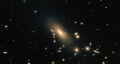

# Preview of potw1445a: "Hubble reveals a super-rich galactic neighbourhood"
[https://www.spacetelescope.org/images/potw1445a/](https://www.spacetelescope.org/images/potw1445a/)

This new image from the NASA/ESA Hubble Space Telescope shows the super-rich galaxy cluster Abell 1413. Located between the constellations of Leo (The Lion) and Coma Berenices, the cluster is over 2 billion light-years from Earth. This image is dominated by a large and highly elliptical galaxy called MCG+04-28-097, with a halo of stars extending for more than 6.5 million light-years [1]. Abell 1413 is part of the Abell catalogue, a collection of over 4000 rich clusters of galaxies fairly close to Earth — at least from a cosmological perspective — their light took less than 3 billion years to reach us. The clusters are called rich due to the huge number of galaxies they play host to. Abell 1413 is observed to contain more than 300 galaxies held together by the immense gravity of the cluster. The strong interactions between these galaxies cause the material in the cluster to be heated to extremely high temperatures of almost 100 million degrees. Because of this, the cluster emits very strong X-ray radiation. Visible distortions in the image can be seen in the form of arcs, caused by gravitational lensing [2]. This image was created from optical and near-infrared exposures taken with the Wide Field Channel of Hubble’s Advanced Camera for Surveys (ACS). A version of this image was entered into the Hubble's Hidden Treasures image processing competition by contestant Nick Rose. Notes [1] The galaxies at the centre of Abell 1413 are found to be very highly elliptical whereas those at the periphery are more spherical. [2] Gravitational lensing occurs when the intense gravity of the cluster bends space-time around it, causing a range of bizarre and beautiful optical phenomena for galaxies located in the background.