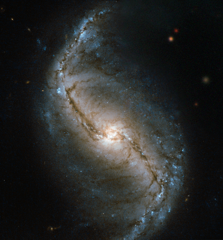

# Preview of potw1446a: "A spiral in a furnace"
[https://www.spacetelescope.org/images/potw1446a/](https://www.spacetelescope.org/images/potw1446a/)

This new Hubble image is a snapshot of NGC 986 — a barred spiral galaxy discovered in 1828 by James Dunlop. This close-up view of the galaxy was captured by Hubble’s Wide Field and Planetary Camera 2 (WFPC2). NGC 986 is found in the constellation of Fornax (The Furnace), located in the southern sky. NGC 986 is a bright, 11th-magnitude galaxy sitting around 56 million light-years away, and its golden centre and barred swirling arms are clearly visible in this image. Barred spiral galaxies are spiral galaxies with a central bar-shaped structure composed of stars. NGC 986 has the characteristic S-shaped structure of this type of galactic morphology. Young blue stars can be seen dotted amongst the galaxy’s arms and the core of the galaxy is also aglow with star formation. To the top right of this image the stars appear a little fuzzy. This is because a gap in the Hubble data was filled in with data from ground-based telescopes. Although the view we see in this filled in patch is accurate, the resolution of the stars is no match for Hubble’s clear depiction of the spiral galaxy.