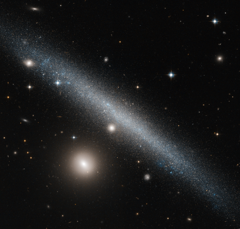

# Preview of potw1447a: "A slashing smudge across the sky"
[https://www.spacetelescope.org/images/potw1447a/](https://www.spacetelescope.org/images/potw1447a/)

The galaxy cutting dramatically across the frame of this NASA/ESA Hubble Space Telescope image is a slightly warped dwarf galaxy known as UGC 1281. Seen here from an edge-on perspective, this galaxy lies roughly 18 million light-years away in the constellation of Triangulum (The Triangle). The bright companion to the lower left of UGC 1281 is the small galaxy PGC 6700, officially known as 2MASX J01493473+3234464. Other prominent stars belonging to our own galaxy, the Milky Way, and more distant galaxies can be seen scattered throughout the sky. The side-on view we have of UGC 1281 makes it a perfect candidate for studies into how gas is distributed within galactic halos — the roughly spherical regions of diffuse gas extending outwards from a galaxy’s centre. Astronomers have studied this galaxy to see how its gas vertically extends out from its central plane, and found it to be a quite typical dwarf galaxy. However, it does have a slightly warped shape to its outer edges, and is forming stars at a particularly low rate. A version of this image was entered into the Hubble's Hidden Treasures image processing competition by contestant Luca Limatola. Links  Luca Limatola's Hidden Treasures entry on Flickr 