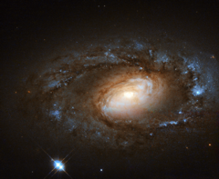

# Preview of potw1448a: "This is no supermodel spiral"
[https://www.spacetelescope.org/images/potw1448a/](https://www.spacetelescope.org/images/potw1448a/)

The NASA/ESA Hubble Space Telescope observes some of the most beautiful galaxies in our skies — spirals sparkling with bright stellar nurseries (heic1403), violent duos ripping gas and stars away from one another as they tangle together (heic1311), and ethereal irregular galaxies that hang like flocks of birds suspended in the blackness of space (heic1114, heic1207). However, galaxies, like humans, are not all supermodels. This little spiral, known as NGC 4102, has a different kind of appeal, with its tightly-wound spiral arms and understated, but charming, appearance. NGC 4102 lies in the northern constellation of Ursa Major (The Great Bear). It contains what is known as a LINER, or low-ionization nuclear emission-line region, meaning that its nucleus emits particular types of radiation — specifically, emission from weakly-ionised or neutral atoms of certain elements. Even in this sense, NGC 4102 is not special; around one third of all nearby galaxies are thought to be LINER galaxies. Many LINER galaxies also contain intense regions of star formation. This is thought to be intrinsically linked to their centres but just why is still a mystery for astronomers — either the starbursts pour fuel inwards to fuel the LINERs, or this active central region triggers the starbursts. NGC 4102 does indeed contain a starburst region towards its centre, where stars are being created at a rate much more furious than in a normal galaxy. This star formation is taking place within a small rotating disc, around 1000 light-years in diameter and with a mass some three billion times the mass of the Sun. This image uses infrared and visible observations taken using Hubble’s Wide Field Planetary Camera 2. A version of this image was submitted to the Hubble's Hidden Treasures image processing competition by contestant Renaud Houdinet. A team of astronomers led by Stephen Smartt of Queen's University Belfast, the Principal Investigator for the observations making up this image, have spent the last 15 years searching for the progenitor stars of supernovae in galaxy images like this. A recent review article explores some of the results from such studies. Link  Renaud Houdinet’s Hidden Treasures entry on Flickr 