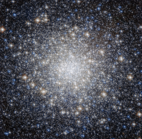

# Preview of potw1449a: "All that glitters"
[https://www.spacetelescope.org/images/potw1449a/](https://www.spacetelescope.org/images/potw1449a/)

This striking new NASA/ESA Hubble Space Telescope image shows a glittering bauble named Messier 92. Located in the northern constellation of Hercules, this globular cluster — a ball of stars that orbits a galactic core like a satellite — was first discovered by astronomer Johann Elert Bode in 1777. Messier 92 is one of the brightest globular clusters in the Milky Way, and is visible to the naked eye under good observing conditions. It is very tightly packed with stars, containing some 330 000 stars in total. As is characteristic of globular clusters, the predominant elements within Messier 92 are hydrogen and helium, with only traces of others. It is actually what is known as an Oosterhoff type II (OoII) globular cluster, meaning that it belongs to a group of metal-poor clusters — to astronomers, metals are all elements heavier than hydrogen and helium. By exploring the composition of globulars like Messier 92, astronomers can figure out how old these clusters are. As well as being bright, Messier 92 is also old, being one of the oldest star clusters in the Milky Way, with an age almost the same as the age of the Universe. A version of this image was entered into the Hubble’s Hidden Treasures image processing competition by contestant Gilles Chapdelaine. Links  Gilles Chapdelaine’s Hidden Treasures entry on Flickr 