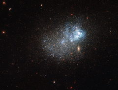

# Preview of potw1450a: "A messy star factory"
[https://www.spacetelescope.org/images/potw1450a/](https://www.spacetelescope.org/images/potw1450a/)

This sprinkle of cosmic glitter is a blue compact dwarf galaxy known as Markarian 209. Galaxies of this type are blue-hued, compact in size, gas-rich, and low in heavy elements. They are often used by astronomers to study star formation, as their conditions are similar to those thought to exist in the early Universe. Markarian 209 in particular has been studied extensively. It is filled with diffuse gas and peppered with star-forming regions towards its core. This image captures it undergoing a particularly dramatic burst of star formation, visible as the lighter blue cloudy region towards the top right of the galaxy. This clump is filled with very young and hot newborn stars. This galaxy was initially thought to be a young galaxy undergoing its very first episode of star formation, but later research showed that Markarian 209 is actually very old, with an almost continuous history of forming new stars. It is thought to have never had a dormant period — a period during which no stars were formed — lasting longer than 100 million years. The dominant population of stars in Markarian 209 is still quite young, in stellar terms, with ages of under 3 million years. For comparison, the Sun is some 4.6 billion years old, and is roughly halfway through its expected lifespan. The observations used to make this image were taken using Hubble’s Wide Field Camera 3 and Advanced Camera for Surveys, and span the ultraviolet, visible, and infrared parts of the spectrum. A scattering of other bright galaxies can be seen across the frame, including the bright golden oval that could, due to a trick of perspective, be mistaken as part of Markarian 209 but is in fact a background galaxy. A version of this image was entered into the Hubble's Hidden Treasures image processing competition by contestant Nick Rose. Links:  Nick Rose’s Hidden Treasures entry on Flickr 