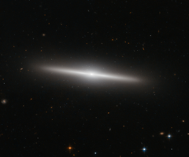

# Preview of potw1451a: "The beautiful side of IC 335"
[https://www.spacetelescope.org/images/potw1451a/](https://www.spacetelescope.org/images/potw1451a/)

This new NASA/ESA Hubble Space Telescope image shows the galaxy IC 335 in front of a backdrop of distant galaxies. IC 335 is part of a galaxy group containing three other galaxies, and located in the Fornax Galaxy Cluster 60 million light-years away. As seen in this image, the disc of IC 335 appears edge-on from the vantage point of Earth. This makes it harder for astronomers to classify it, as most of the characteristics of a galaxy’s morphology — the arms of a spiral or the bar across the centre — are only visible on its face. Still, the 45 000 light-year-long galaxy could be classified as an S0 type. These lenticular galaxies are an intermediate state in galaxy morphological classification schemes between true spiral and elliptical galaxies. They have a thin stellar disc and a bulge, like spiral galaxies, but in contrast to typical spiral galaxies they have used up most of the interstellar medium. Only a few new stars can be created out of the material that is left and the star formation rate is very low. Hence, the population of stars in S0 galaxies consists mainly of aging stars, very similar to the star population in elliptical galaxies. As S0 galaxies have only ill-defined spiral arms they are easily mistaken for elliptical galaxies if they are seen inclined face-on or edge-on as IC 335 here. And indeed, despite the morphological differences between S0 and elliptical class galaxies, they share a some common characteristics, like typical sizes and spectral features. Both classes are also early-type galaxies, as they are evolving passively. However, elliptical galaxies may be passively evolving when we observe them, but they had violent interactions with other galaxies in their past. Whereas S0 galaxies are either aging and fading spiral galaxies, which never had any interactions with other galaxies, or they are the aging result of a single merger between two spiral galaxies in the past. The exact nature of these galaxies is still a matter of debate. Links  Structure and Formation of S0 and Spheroidal Galaxies Can Early Type Galaxies Evolve from Fading the Disks of Late Types? 