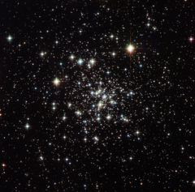

# Preview of potw1452a: "An ancient globule"
[https://www.spacetelescope.org/images/potw1452a/](https://www.spacetelescope.org/images/potw1452a/)

This image captures the stunning NGC 6535, a globular cluster 22 000 light-years away in the constellation of Serpens (The Serpent) that measures one light-year across. Globular clusters are tightly bound groups of stars which orbit galaxies. The large mass in the rich stellar centre of the globular cluster pulls the stars inward to form a ball of stars. The word globulus, from which these clusters take their name, is Latin for small sphere. Globular clusters are generally very ancient objects formed around the same time as their host galaxy. To date, no new star formations have been observed within a globular cluster, which explains the abundance of aging yellow stars in this image, most of them containing very few heavy elements. NGC 6535 was first discovered in 1852 by English astronomer John Russell Hind. The cluster would have appeared to Hind as a small, faint smudge through his telescope. Now, over 160 years later, instruments like the Advanced Camera for Surveys (ACS) and Wide Field Camera 3 (WFC3) on the NASA/ESA Hubble Space Telescope allow us to capture the cluster close up and marvel at its contents in detail. A version of this image was entered into the Hubble's Hidden Treasures image processing competition by contestant Gilles Chapdelaine. Link:  Gilles Chapdelaine's image on Flickr 