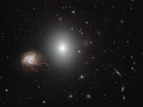

# Preview of potw1838a: "Knots and bursts"
[https://www.spacetelescope.org/images/potw1838a/](https://www.spacetelescope.org/images/potw1838a/)

 In the northern constellation of Coma Berenices (Berenice's Hair) lies the impressive Coma Cluster — a structure of over a thousand galaxies bound together by gravity. Many of these galaxies are elliptical types, as is the brighter of the two galaxies dominating this image: NGC 4860 (centre). However, the outskirts of the cluster also host younger spiral galaxies that proudly display their swirling arms. Again, this image shows a wonderful example of such a galaxy in the shape of the beautiful NGC 4858, which can be seen to the left of its bright neighbour and which stands out on account of its unusual, tangled, fiery appearance. NGC 4858 is special. Rather than being a simple spiral, it is something called a “galaxy aggregate”, which is, just as the name suggests, a central galaxy surrounded by a handful of luminous knots of material that seem to stem from it, extending and tearing away and adding to or altering its overall structure. It is also experiencing an extremely high rate of star formation, possibly triggered by an earlier interaction with another galaxy. As we see it, NGC 4858 is forming stars so frantically that it will use up all of its gas long before it reaches the end of its life. The colour of its bright knots indicates that they are formed of hydrogen, which glows in various shades of bright red as it is energised by the many young, hot stars lurking within. This scene was captured by the NASA/ESA Hubble Space Telescope’s Wide Field Camera 3 (WFC3), a powerful camera designed to explore the evolution of stars and galaxies in the early Universe. 