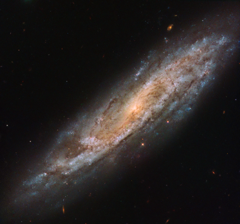
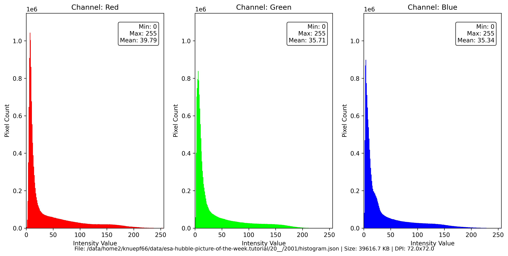

# Preview of potw2001a: "Imposter or the Real Deal?"
[https://www.spacetelescope.org/images/potw2001a/](https://www.spacetelescope.org/images/potw2001a/)

This Picture of the Week, taken by the NASA/ESA Hubble Space Telescope, shows a close-up view of a galaxy named NGC 2770. NGC 2770 is intriguing, as over time it has hosted four different observed supernovae (not visible here).  Supernovae form in a few different ways, but always involve a dying star. These stars become unbalanced, lose control, and explode violently, briefly shining as brightly as an entire galaxy before slowly fading away. One of the four supernovae observed within this galaxy, SN 2015bh, is especially interesting. This particular supernova initially had its identity called into question. When it was first discovered in 2015, astronomers classified SN 2015bh as a supernova imposter, believing it to be not an exploding star but simply an unpredictable outburst from a massive star in its final phase of life. Thankfully, astronomers eventually discovered the truth and the object was given its correct classification as a Type II supernova, resulting from the death of a star between eight and 50 times the mass of the Sun.

# Histogram

