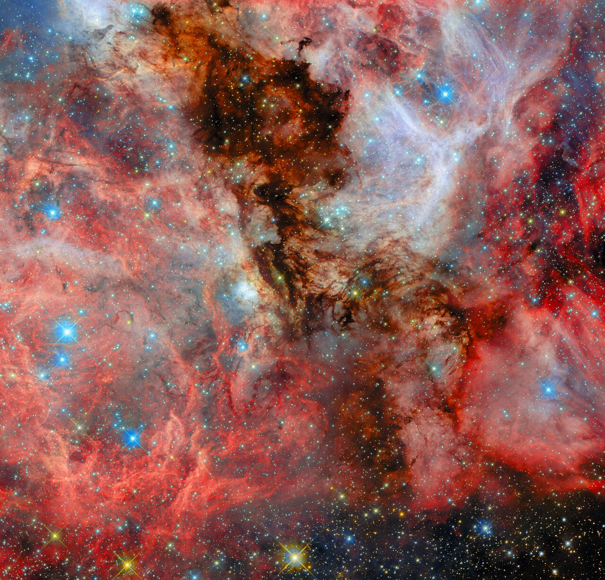

# A neighbouring vista of stellar birth

[https://www.spacetelescope.org/images/potw2552a/](https://www.spacetelescope.org/images/potw2552a/)
 

Today’s ESA/Hubble Picture of the Week highlights another view of a distant stellar birthplace. Captured in a parallel field to a recently released image, this scene reveals a neighbouring region of the N159 star-forming complex in the Large Magellanic Cloud, approximately 160 000 light-years away.

Thick clouds of cold hydrogen gas dominate the scene, forming a complex network of ridges, cavities, and glowing filaments. Embedded within these dense clouds, newly formed stars begin to shine, their intense radiation causing the surrounding hydrogen to glow in deep red tones.

The brightest regions mark the presence of hot, massive young stars whose powerful stellar winds and energetic light reshape their environment. These forces carve out bubble-like structures and hollowed cavities in the gas, clear signatures of stellar feedback in action. Dark clouds in the foreground are lit from behind by new stars. Together, the glowing clouds and sculpted bubbles reveal a dynamic interplay between star formation and the material from which stars are born, capturing the ongoing cycle of creation and transformation within this neighbouring galactic system.

N159 is one of the most massive star-forming clouds in the Large Magellanic Cloud, a dwarf galaxy that is the largest of the small galaxies that orbit the Milky Way. This image shows just a portion of this expansive star-forming complex, as the entire complex stretches over 150 light-years across.

[Image description: A field filled with stars and covered by clouds of gas and dust. In the centre, a thick column of dark black dust blocks light from stars that light it up from behind. More clouds behind those stars are illuminated in pale colours. Complex, layered filaments of red dust lie to the left and right. Blue, white and gold stars in various sizes can be seen around, within and through the colourful layers of dust.]
