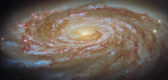

# Preview of potm2605a: "Journey to the centre of a galaxy cluster"
[https://esahubble.org/images/potm2605a/](https://esahubble.org/images/potm2605a/)

The focus of today’s ESA/Hubble Picture of the Month is an active spiral galaxy on a journey lasting hundreds of millions of years. The galaxy Messier 88 (M88), which is also known as NGC 4501, is located about 63 million light-years away in the constellation Coma Berenices (Berenice’s Hair).  M88 is an active galaxy, which means that its centre harbours a supermassive black hole that is snacking on gas and dust. This black hole is estimated to be around 100 million times as massive as the Sun, and it appears to be powering outflows of gas from the galaxy’s centre. Around this black hole is a population of old, reddish stars that give M88 its warmly glowing heart. Spreading out from the centre are several tightly wound, symmetrical spiral arms, each outlined by sparkling pink and blue star clusters and knotted clouds of dust. We see M88 from an angle so that it appears elongated, and its spiral arms delicately fan out before it. M88 is a member of the Virgo Cluster, a collection of more than a thousand galaxies held together by gravity — and therefore linked by fate. As this massive group of galaxies moves through space, the galaxies themselves are in constant motion as they orbit the cluster’s centre of gravity. M88 itself is on a long and somewhat perilous cosmic journey that will bring it to the innermost reaches of the cluster. As is the case with any epic journey, M88 will be fundamentally changed by its trek to the centre of the Virgo Cluster, about 2 million light-years from where it is today. In 200–300 million years, M88 will make its closest approach to Messier 87, the massive elliptical galaxy that anchors the entire cluster. As it draws close to this gravitational behemoth, M88 will experience intense ram pressure stripping. Ram pressure stripping is a process through which a galaxy’s gas is swept away as it pushes through the ever-present gas between the galaxies in a cluster. Researchers have already seen this process at work in M88. The galaxy’s swirling disc of gas is truncated, and it appears to have been compressed on the leading edge of the galaxy, piling up like snow before a plough. In fact, M88 appears to have considerably less cold gas — the raw fuel for star formation — than expected for a galaxy of its size, especially in its outer regions. This is a clear sign that M88 will be altered by its journey, which will affect its ability to form stars and alter the course of its evolution. Astronomers observed M88 with Hubble as part of an observing programme (#18103; PI: D. Thilker) dedicated to understanding the lives of spiral galaxies in crowded environments. This programme uses Hubble’s highly capable Wide Field Camera 3, which can finely resolve individual star clusters and nebulae in galaxies tens of millions of light-years away. By studying galaxies on these scales, astronomers can understand how a journey through a cluster impacts galaxies’ evolution and ability to form new stars. [Image Description: A large spiral galaxy. It is seen tilted at an angle, so that it is foreshortened and appears very wide. Its tightly-wound, blue spiral arms swirl out from its glowing centre, spreading apart at the tips. They are followed by strands and clumps of dark red dust, and spotted with pink dots where stars are forming in clouds of gas. The galaxy is surrounded by a slight glow and lies on a dark background.] Links  Image on ESA website Pan video: M88 