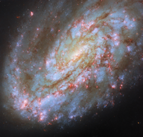

# Preview of potm2607a: "One-sided spiral"
[https://esahubble.org/images/potm2607a/](https://esahubble.org/images/potm2607a/)

The subject of this ESA/Hubble Picture of the Month is a spiral galaxy struggling against some of the titanic forces that appear on galactic scales in space. This is NGC 4654, an intermediate spiral galaxy in the constellation Virgo (the Maiden). “Intermediate” means that it lies between the spiral galaxies that have a bar across the centre and those that don’t, with a weak bar structure in its centre. It is situated 72 million light-years from Earth in the Virgo Cluster, a particularly massive and populous galaxy cluster. NGC 4654 is particularly asymmetric, with a rounded and clearly-defined edge on one side and a long tail of gas stretching out from the opposite side — beyond Hubble’s view in this image. The cause of this gaseous tail is the same as for many of the other galaxies jostling in the crowded Virgo Cluster: namely, ram pressure stripping. NGC 4654 moves with such high velocity through space that it sweeps up and rams through the intracluster medium, the hot, rarefied gas filling the space between the Virgo Cluster’s galaxies. The intracluster medium in turn exerts a “ram pressure” on the galaxy, compressing the galaxy’s leading edge and tugging at its gas, creating the elongated tail.  It’s not just the galaxy’s gas that is unevenly distributed: its stars are too, and this is more unusual for a spiral galaxy. While the spiral arm on its leading edge is rich with stars and gas, the opposite arm noticeably lacks stars, influencing the galaxy’s lopsided spiral shape. It’s thought that ram pressure alone is unlikely to have had this effect. Rather, NGC 4654 has also been subjected to the gravitational force of the fellow Virgo Cluster galaxy NGC 4639. While the two galaxies are far apart now, it’s thought that a fly-by interaction between them around 500 million years ago ripped away NGC 4654’s gas along one side, limiting star formation there and creating the asymmetry in its shape. Many galaxies that undergo ram pressure stripping suffer reduced star formation rates as the cold gas that collapses to form their stars is pulled away and lost. NGC 4654, however, is still forming nearly two Suns’ worth of stars every year, a rate comparable to other galaxies of similar size. The active star formation can be seen in the latest Hubble data used in this image, which picks up on a wavelength of red light that’s emitted by the clouds of energised gas where newborn stars lurk. The bright pink bubbles appear all across NGC 4654, from its forward spiral arm, to around its weak bar, and out to the edge of its disc. The data used for this image come from two observing programmes (#15654, #17502) that have the aim of linking gas in galaxies with star formation. By observing many prominent galaxies in the vicinity of our own, researchers hope to better understand how gas moves around in galaxies, where and when it collapses to form stars and star clusters, and what effect those new stars have on the gas around them. [Image Description: A spiral galaxy. It has a prominent spiral arm on one side (lower left) and a wide, glowing core. Dark brown filaments of dust swirl through its disc, while blue clusters of stars are found mostly going out to its arm. On the opposite side to the arm (upper right), gas trails off from the disc, out of the view in this image. A matching spiral arm is not visible on this side. The galaxy lies on a dark background.] Links  Pan video 